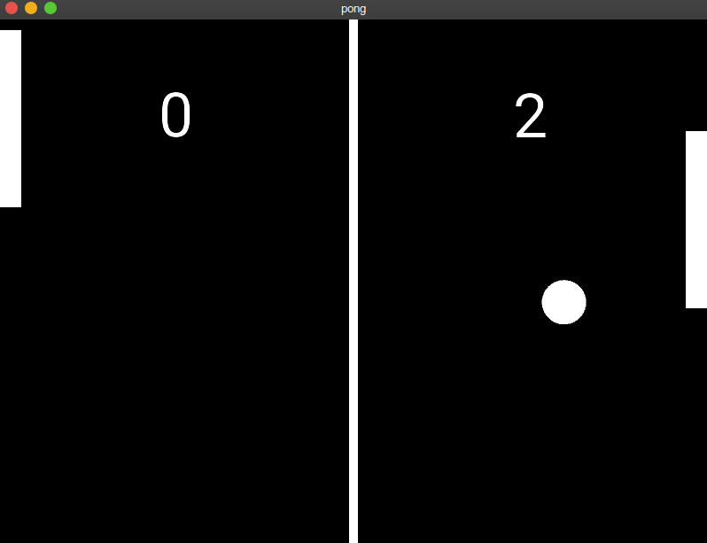

## Ping Pong

### Double Player Ping pong game build using python 

## Technology used 
  
  #### Python
  #### Kivy 

## Usage 
##### Python main.py 
###   OR 
##### Install apk file in android 
  
## Images 

 </img>
                                                              
 
  
